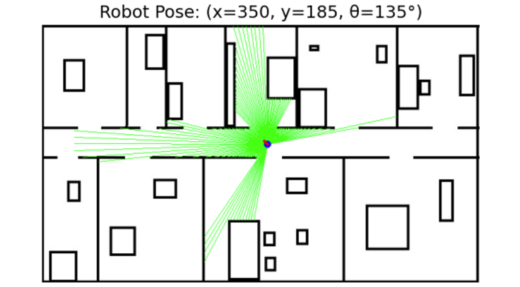
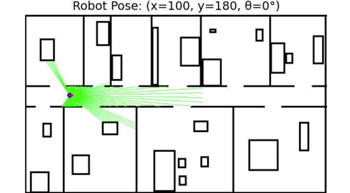
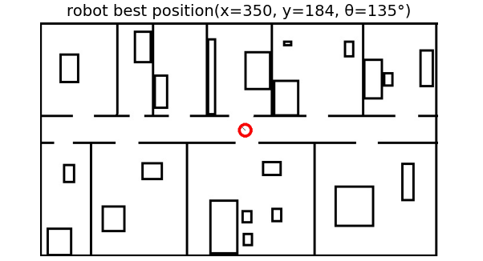
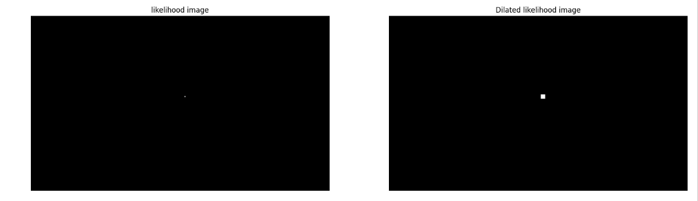
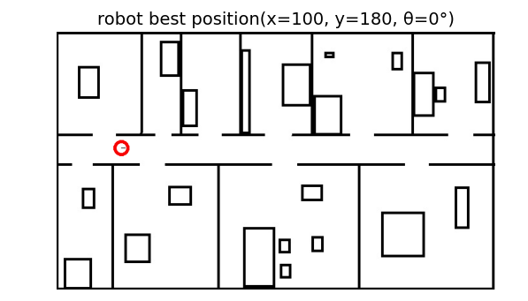
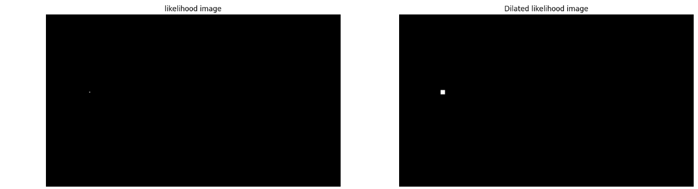

<h1 align="center">Robotics-Assignment</h1>

## 📝 Table of Contents
- [ Requirement 1](#Requirement1)  
- [ Requirement 2](#Requirement2)
##  Requirement 1 

### How It Works
1. The `laser_measurements` function:
   - Converts the input map to grayscale.
   - Casts laser rays from the robot's position at angles ranging from -125° to 125°.
   - Calculates the distance to obstacles and the endpoint of each laser beam.
   
2. The `draw` function:
   - Visualizes the robot's position and orientation.
   - Plots the laser beams and obstacle endpoints on the map.

### Results:

  

##  Requirement 2 
### How It Works
1. Finding the Most Likely Pose:
The function `find_most_likely_pose()` searches the entire map for the pose with the highest probability. It iterates over possible positions (x, y) and orientations theta to find the best match.

2. Visualization:
The function `draw_pose()` displays:
The robot's best pose on the map.
The likelihood map showing the probability distribution.

### Results Given measurements from Requirement 1:
<h4  align='center'>  first measurements<h4>

<h4  align='center'> second measurements</h4>

